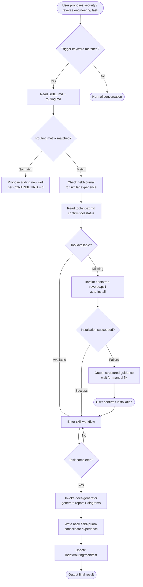
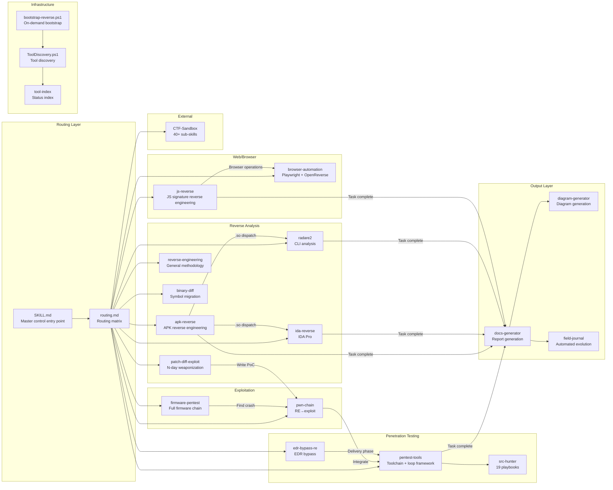
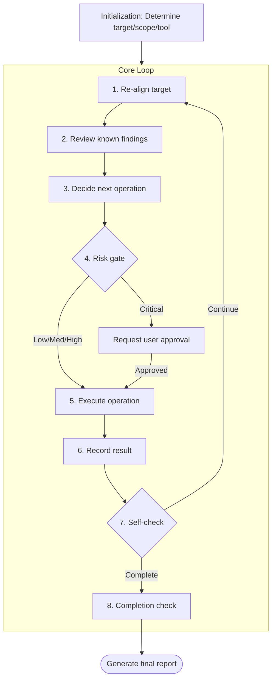
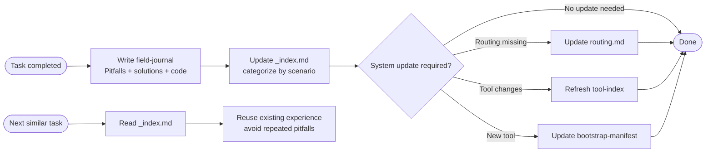
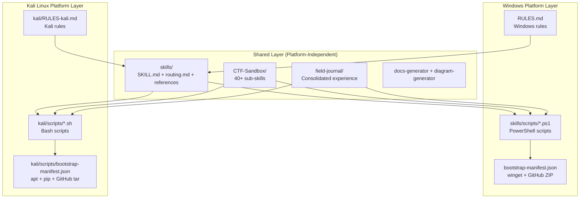
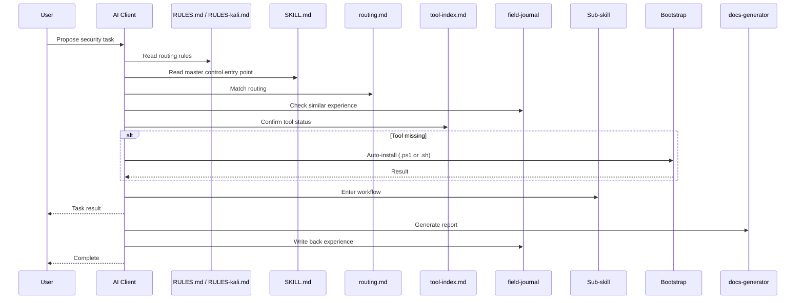

# System Architecture Diagrams

## Complete Behavior Chain Flowchart

## Skills Module Relationship Diagram

## Bootstrap Process

```mermaid
flowchart TD
    Need[Detected missing tool] --> ReadManifest[Read bootstrap-manifest.json]
    ReadManifest --> Kind{Installation type?}
    
    Kind -->|github-release-zip| GH[Download ZIP from GitHub Release<br/>and extract]
    Kind -->|pip-package| Pip[pip install]
    Kind -->|npm-mcp| NPM[npx start + register MCP]
    Kind -->|npm-global| Global[npm install -g<br/>+ postInstall]
    Kind -->|winget-package| Winget[winget install]
    Kind -->|local-http-mcp| HTTP[Register URL + start service]
    
    GH & Pip & NPM & Global & Winget & HTTP --> Verify{Verify available?}
    Verify -->|Success| AddPath[Add to PATH<br/>refresh tool-index]
    Verify -->|Failure| Manual[Output manual installation guide]
    
    AddPath --> Continue([Continue executing task])
    Manual --> Wait([Wait for user confirmation])
```

## Penetration Testing Loop

## Auto-Evolution Mechanism

## Multi-Platform Architecture

### Platform Selection Logic

| Environment | Rules File Used | Scripts Used | Package Management |
|------|--------------|-----------|--------|
| Windows | `RULES.md` | `skills/scripts/*.ps1` | winget / GitHub Release ZIP |
| Kali Linux | `kali/RULES-kali.md` | `kali/scripts/*.sh` | apt / pip / npm / GitHub tar.gz |

### Kali Edition Features

- **Many tools pre-installed**: nmap, sqlmap, hashcat, hydra, metasploit, radare2, binwalk, burpsuite, etc. require no bootstrap
- **Unified apt management**: No winget needed, no manual ZIP extraction needed
- **Native bash**: Scripts are concise with no PowerShell dependencies
- **Standard paths**: `/usr/bin/`, `/opt/`, `~/tools/`, no drive letters or whitespace issues

## File Reading Sequence Diagram

