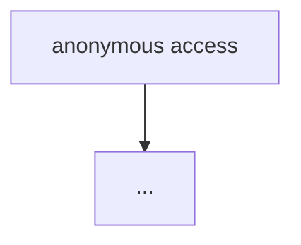

# Penetration Test Report: <target> (<engagement type>)

- Date: YYYY-MM-DD
- Target: `<host-or-scope>`
- Scope: <in-scope assets>
- Method: <passive / active / code-audit / ...>

## Executive summary

<2-4 bullets, one per core issue, with severity in parentheses>

## Finding 1: <title>

- Severity: high
- Affected endpoints: `METHOD /path`
- Description: <what, why exploitable, preconditions>

### PoC

```bash
curl ...
```

### Evidence

- <request/response/log refs>

### Remediation

1. <actionable, ordered>

## Finding 2: <title>

- Severity: medium
...

## Attack path



## Risk conclusion

<combined risk / business impact>

<!-- Chinese variant headings (`## vulnerability N：`, `risk等级：`, `Testing日期：`) are parsed identically by mkreport.py -->
